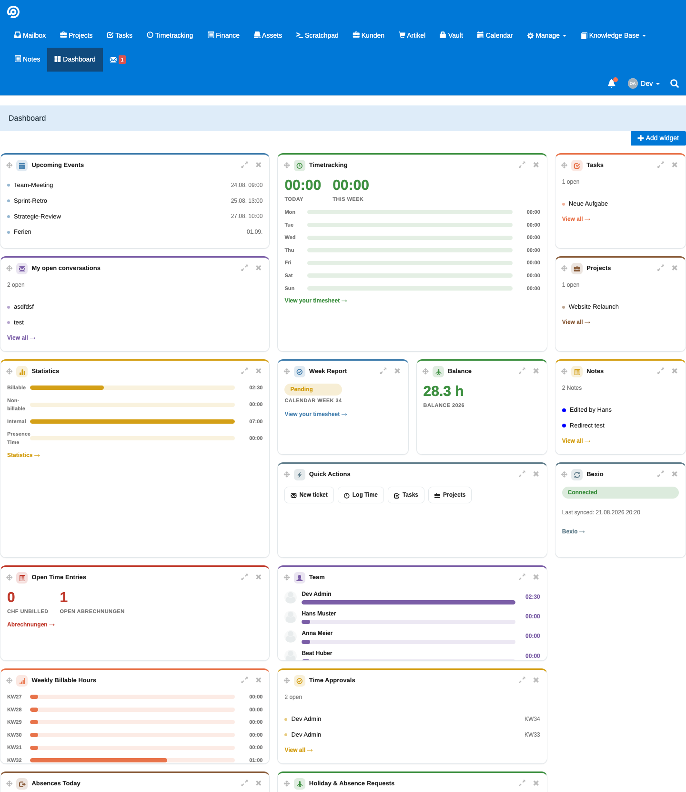

# Dashboard

Your own personal start page in FreeScout — a board of widgets you can add, remove, resize and drag into the order you like, the same way you'd arrange widgets on your phone or Mac.

## What it does

Every staff member gets their own board, separate from everyone else's. Pick from widgets like:

- **Upcoming Events** — your next appointments from the Calendar
- **Timetracking** and **Week Report** — today's and this week's captured hours at a glance
- **My open conversations** — your open tickets, without digging through the mailbox
- **Projects** and **Tasks** — what's currently assigned to you
- **Notes** — your latest sticky notes
- **Weather** — current conditions and a 7-day forecast for any city you choose
- **Quick Actions** — one click to a new ticket, logging time, or jumping into tasks/projects
- ...and several more for team leads and admins (open invoices, who's on holiday today, pending approvals, and so on)

Widgets that depend on a module your company hasn't installed (e.g. Bexio or Calendar) simply don't show up — nothing breaks, nothing shows an error, they just aren't offered.

## Using it

- Click **Add widget** to pick from what's available.
- Drag a widget by its handle to move it anywhere on the board — everything else reflows around it automatically.
- Each widget can be small, medium or large — click the resize icon on its card to cycle through.
- Click the **×** on a card to remove it any time; it's still there in the picker if you want it back later.
- Some widgets (currently Weather) have their own small settings — look for the gear icon on the card.

Your layout is saved automatically and is exactly as you left it next time you open the Dashboard.

## Requirements

None — Dashboard works standalone. A few widgets light up automatically once you also have the matching module installed (Calendar, Invoicing, Hr, Notes, or Bexio), but nothing is required to use the Dashboard itself.
